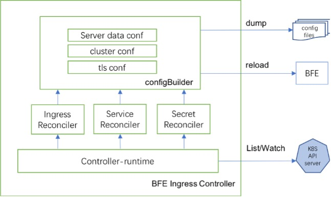

# BFE Ingress Controller 工作原理

## 核心处理逻辑

> 前置知识
> - 什么是 [Ingress](https://kubernetes.io/docs/concepts/services-networking/ingress/)
> - 什么是 [Ingress Controller](https://kubernetes.io/docs/concepts/services-networking/ingress-controllers/)

BFE Ingress Controller 的核心处理逻辑是：
1. 监听获取 k8s 集群中的 Ingress 资源
2. 解析 Ingress 资源中定义的配置逻辑，生成对应的 BFE 配置
3. 使新生成的 BFE 配置在 BFE进程中生效

## 如何实现 Ingress 资源的监听

通过 [Kubernetes controller-runtime][] 框架实现：
1. 创建 Manager，Manager 内部维护了 Client、Cache 和 Schema 等
2. 创建 Reconciler，并实现回调逻辑
3. 使用 Builder 模式创建 Controller，并指定监听 Ingress 资源和对应的 Reconcile
4. 启动 Manager

## BFE配置如何定义

BFE 的配置定义可以通过以下方式获得：
1. 官网文档：[配置概述][]（主要关注动态配置）
2. BFE 源码： bfe/[bfe_modules][]/mod_\*/\*_load.go 

官网更新可能存在延迟，以源代码为准。

> 常见动态配置：
> - 流量路由配置
>   - [域名规则配置](https://www.bfe-networks.net/zh_cn/configuration/server_data_conf/host_rule.data/)
>   - [分流规则配置](https://www.bfe-networks.net/zh_cn/configuration/server_data_conf/route_rule.data/)
> - 负载均衡配置
>   - [子集群负载均衡配置](https://www.bfe-networks.net/zh_cn/configuration/cluster_conf/gslb.data/)
> - 接入协议配置
>   - [TLS协议配置](https://www.bfe-networks.net/zh_cn/configuration/tls_conf/tls_rule_conf.data/)
> - 扩展模块配置
>   - [mod_header 配置](https://www.bfe-networks.net/zh_cn/modules/mod_header/mod_header/)
>   - [mod_redirect 配置](https://www.bfe-networks.net/zh_cn/modules/mod_header/mod_redirect/)
>   - [mod_rewrite 配置](https://www.bfe-networks.net/zh_cn/modules/mod_header/mod_rewrite/)

## BFE配置如何生效

通过 BFE [配置热加载][]，完成在 BFE 不停机的情况下更新动态配置。

[Kubernetes controller-runtime]: https://github.com/kubernetes-sigs/controller-runtime
[配置概述]: https://www.bfe-networks.net/zh_cn/configuration/config/
[bfe_modules]: https://github.com/bfenetworks/bfe/tree/develop/bfe_modules
[配置热加载]: https://www.bfe-networks.net/zh_cn/operation/reload/